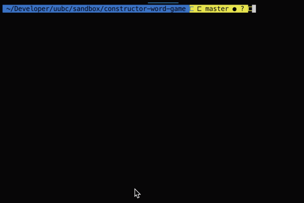

# JS Constructor Practice: A CLI Word Guessing Game

With this app, I built a word guessing game (think: hangman) using NodeJS. I focused on the concepts of JS classes/constructors and modularization.

## How to play

Once you install the app's dependencies ("Inquirer"), run `> node index` to begin the game. Follow the prompts to try to guess the hidden word.

## Demo

